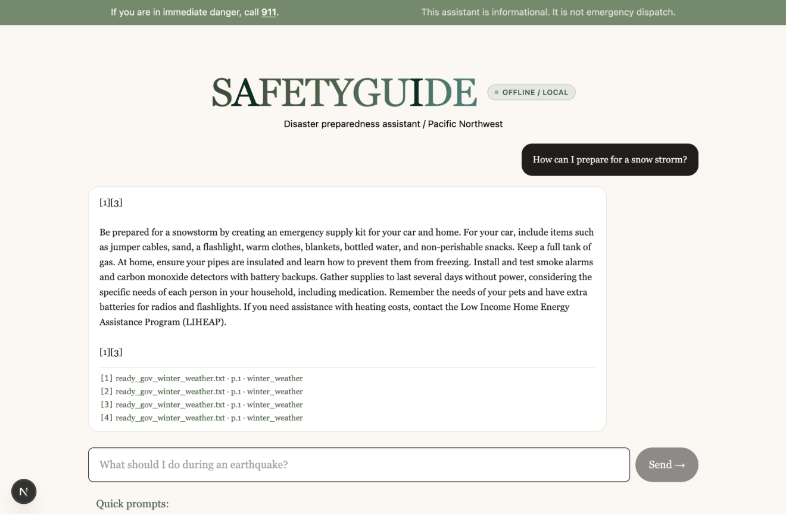
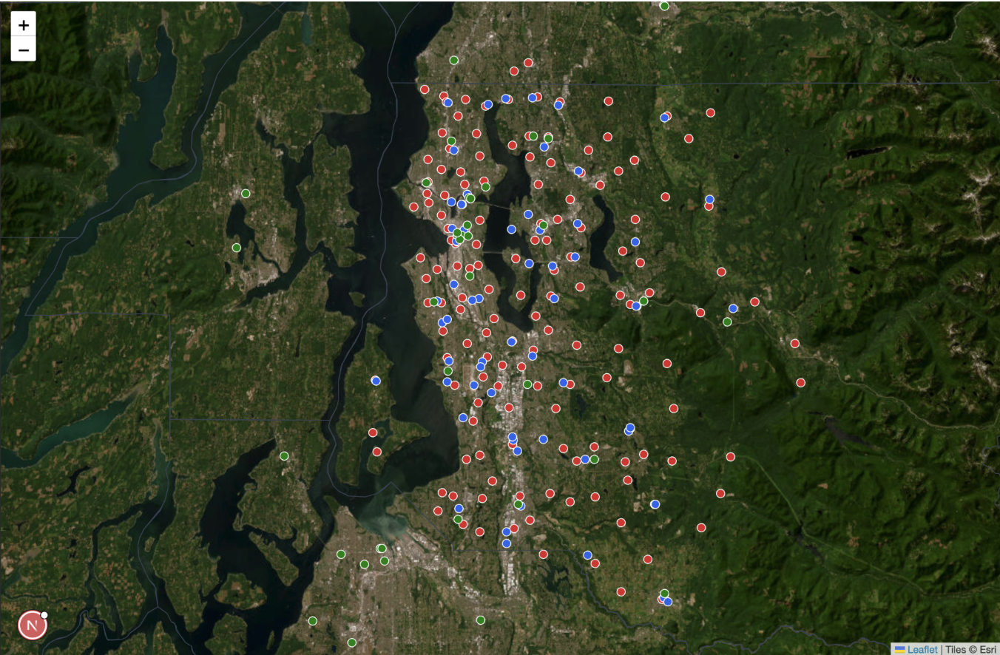

# SafetyGuide.AI

An offline-first, retrieval-augmented disaster preparedness chatbot for the Pacific Northwest. Every component — embeddings, vector search, keyword search, cross-encoder reranker, and a 7B-parameter language model — runs locally on a single laptop. With wifi off, it still works.

Built for the Everybody Hacks 2026 Disaster Response track.

---

## Demo

Watch the demo on YouTube: **[SafetyGuide.AI walkthrough](https://youtu.be/UMFcAi7lDxU)**

[](https://youtu.be/UMFcAi7lDxU)

The demo walks through two queries against the deployed system:

1. **In-corpus question** — *"What can I do against a volcano eruption?"* The bot returns a grounded, cited answer drawn from the local knowledge base.
2. **Out-of-corpus question** — *"Who won the FIFA World Cup?"* The confidence gate correctly refuses to answer rather than hallucinate.

It also shows the interactive PNW resource map.

### Slide deck

View our hackathon presentation: **[SafetyGuide.AI slide deck (Canva)](https://canva.link/dbib27r46a93nfv)** — covers the motivation, architecture, guardrails, and roadmap in pitch form.

---

## Screenshots


*The interactive Pacific Northwest resource map — Information at a Glance (IAAG) for nearby emergency services, shelters, and response infrastructure.*

---

## Inspiration

The Pacific Northwest (PNW) faces a unique combination of significant natural disasters due to its location on the Ring of Fire and varied climate — primarily earthquakes, volcanic eruptions, tsunamis, wildfires, and flooding. The region is especially noted for the threat of a "Cascadia Subduction Zone" megathrust earthquake, which could produce catastrophic damage.

Cloud chatbots fail exactly when disasters happen. Cell towers go down, ISPs lose power, and congestion melts what's left of the network. A general-purpose assistant that needs the internet to answer "what do I do during an earthquake?" is unavailable in the moments that matter most.

This project takes the opposite approach. The whole pipeline — embeddings, vector search, keyword search, reranker, and a 7B-parameter language model — lives on the laptop. With wifi off, it still works.

The second non-negotiable is grounding. Every answer cites the source chunks it was built from. When the local index doesn't contain enough evidence to answer confidently, the bot refuses rather than guessing. Wrong disaster advice is harmful — refusal is a feature, not a bug.

---

## What it does

SafetyGuide.AI is an offline-first retrieval-augmented chatbot that answers disaster preparedness and response questions from a local knowledge base of vetted sources (Ready.gov, Red Cross, Washington State Emergency Management Division).

Everything runs on a single laptop. No cloud, no API calls, nothing phones home. The chat ships with built-in IAAG (Information at a Glance) for nearby emergency local services via the interactive map, and the architecture is designed for scalable expansion to additional corpora.

---

## How we built it

SafetyGuide.AI is a full-stack application split into a Python backend and a Next.js frontend, connected via a local FastAPI endpoint.

- **Backend pipeline** ([`server/src/`](server/src/)) — A grounded RAG pipeline orchestrated through five stages: ingestion of vetted PDFs and scrapes into a row-aligned FAISS + BM25 + JSON index ([`ingest.py`](server/src/ingest.py)); hybrid retrieval with Reciprocal Rank Fusion plus a `bge-reranker-base` cross-encoder ([`retrieve.py`](server/src/retrieve.py)); two-stage query parsing that normalizes spelling and tags a `disaster_type` without smuggling in pretrained safety advice ([`query.py`](server/src/query.py)); a thin parse→retrieve orchestrator ([`pipeline.py`](server/src/pipeline.py)); and a generation stage that performs safety-first reordering, enforces inline `[n]` citations, and honors a non-negotiable confidence gate ([`generate.py`](server/src/generate.py)).
- **HTTP shim** — [`server/src/app.py`](server/src/app.py) is a FastAPI server wrapping `src.generate.answer` end-to-end. It binds only to `127.0.0.1` so the demo never touches the network.
- **Frontend** — A Next.js 16 (App Router) + React 19 + Tailwind v4 client in [`client/sg-client/`](client/sg-client/). The browser talks to a server-side route handler at [`app/api/chat/route.js`](client/sg-client/app/api/chat/route.js), which proxies to the FastAPI backend. The interactive PNW resource map is rendered in the same client.
- **Models** — Qwen2.5-7B-Instruct (Q4_K_M GGUF, Metal-accelerated via `llama-cpp-python`) for both query rewriting and generation (shared singleton — loading the model twice would OOM the laptop); `BAAI/bge-small-en-v1.5` for 384-d embeddings; `BAAI/bge-reranker-base` for cross-encoder reranking.

The pipeline at a glance:

```
Documents → Chunking → Embeddings → FAISS Index
                                         ↓
User Query → Query Rewrite (LLM) → ┬─ Semantic retrieval (top 15)
                                   └─ BM25 retrieval (top 15)
                                         ↓
                                   Reciprocal Rank Fusion
                                         ↓
                                   Cross-encoder rerank → Top 4
                                         ↓
                                   Confidence gate (refuse or proceed)
                                         ↓
                                   Qwen2.5-7B → Answer with citations
```

---

## Challenges we ran into

These are the rough edges that shaped the current code. They're documented here so future contributors don't re-walk the same paths.

- **Building offline, end-to-end, in 6 hours.** Wiring a fully local RAG pipeline plus a Next.js client in a single hackathon window was the largest single source of pressure. Using a local GGUF model rather than an API endpoint costs setup time (downloading 4.7 GB of weights, configuring Metal acceleration) before you can even start iterating on the prompt.
- **Multi-column PDFs produced word salad.** Ready.gov brochures and WA EMD documents have sidebars and callouts interleaved with body text. A naive extract turned `"You can survive"` next to a sidebar header into `"You can / Additional Resources / survive"`. The fix is the column-aware extractor in `_extract_page_text` — it builds a horizontal occupancy bitmap per page, finds empty vertical stripes (gutters), and emits each column top-to-bottom. Three poster-style PDFs were unsalvageable algorithmically; those have hand-curated Markdown sidecars in [`server/data/processed/manual_pdfs/`](server/data/processed/manual_pdfs/) instead.
- **The phase classifier got ripped out.** We initially planned a `phase` metadata field ("before", "during", "recovery") so users could filter answers by where they are in a disaster. In practice the same vocabulary narrates all three phases — "stay indoors," "check on neighbors," "have a kit" all appear in before, during, and after sections. The classifier mislabeled enough chunks that we removed the feature end-to-end.
- **The cross-encoder threshold was miscalibrated at first.** We initially set `CONF_THRESHOLD = 0.0`, expecting reranker logits in the `[-10, +10]` range. In practice, `bge-reranker-base` emits sigmoid-normalized scores in `[0, 1]`. At threshold 0, gibberish queries scoring `0.0001` still passed the gate and produced hallucinated answers. We logged scores across the test set, saw legitimate hits at 0.85–0.99 and noise near 0.0001, and raised the threshold to 0.1.
- **Citation contamination in answers.** Qwen2.5-7B occasionally violated the system prompt by citing real chunks *and* hedging with the canned refusal in the same answer. We split the prompt rule into two explicit cases ("no context → canned phrase only" and "context → cite, never use the canned phrase") and added a defensive post-process that strips the canned phrase whenever an answer also contains `[n]` markers.
- **Disaster-type tagging by content keywords mislabeled brochures.** Our first tagger labeled any chunk mentioning "earthquake" as `earthquake`. Multi-hazard prep brochures got mislabeled the moment they mentioned earthquakes as one of several risks. We replaced this with filename-driven defaults and a tight allowlist of override phrases like `"drop, cover, and hold on"` and `"great washington shakeout"` that promote individual chunks from `general` into a specific hazard.
- **Guaranteeing a formatted response from a 7B model.** Getting a 7B local model to consistently produce well-formed cited output is harder than getting GPT-4 to do the same thing. We addressed this through a strict system prompt, a one-shot retry path when no citation markers appear, and the safety-first reordering that exploits LLM primacy bias so the warning-heavy chunk lands at `[1]`/`[2]`.

---

## Accomplishments we're proud of

- **A working offline pipeline with hard guardrails.** The confidence gate provably blocks the LLM from being invoked on low-confidence retrievals. The demo's "Who won the FIFA World Cup?" refusal isn't a hand-coded response — it's the gate firing because no chunk in the local index addresses that question.
- **Grounded answers with verifiable citations.** Every claim in an answer points back to a specific source chunk. We enforce this via the system prompt, a one-shot retry, and a defensive post-process. The output is auditable in a way most cloud chatbots aren't.
- **End-to-end full-stack delivery in the hackathon window.** We shipped not just the RAG pipeline, but a FastAPI shim, a Next.js client, an interactive resource map, and three inspection-style test suites covering chunking, query parsing, and generation.
- **Safety-first chunk reordering.** A small but high-leverage trick: stable-sort retrieved chunks by a count of imperative/warning phrases before prompting. The cross-encoder is good at topical relevance, but topical relevance isn't life-safety priority. The reorder makes truncated answers still lead with the warning.
- **Manual sidecar mechanism for unsalvageable PDFs.** Rather than dropping poor-OCR brochures, contributors can write Markdown sidecars at [`server/data/processed/manual_pdfs/<pdf_name>.md`](server/data/processed/manual_pdfs/) and the ingest pipeline will use them verbatim, bypassing token re-splitting and the low-content filter.

---

## What we learned

- **Inspect the empirical distribution of any gating signal before you pick a threshold.** Our `CONF_THRESHOLD` story is the textbook example: we set 0.0 based on what we *expected* the reranker to emit, and it took an evening of logging scores across the test set to discover the actual range was sigmoid-normalized.
- **Hand-curated synonym tables beat letting the LLM "be helpful" in domain-sensitive contexts.** We explicitly forbid the query-parser LLM from expanding vocabulary because an unprompted "drop, cover, and hold on" rewrite would smuggle its (possibly outdated) pretraining advice past the grounded-RAG gate.
- **Don't reach for LangChain.** Direct library calls (sentence-transformers, FAISS, rank-bm25, llama-cpp-python) are dramatically easier to debug under time pressure than a stack of framework abstractions. Every minute we didn't spend chasing a LangChain version mismatch was a minute we spent improving retrieval quality.
- **Small, section-aware chunks beat large ones for 7B-class models.** 300 tokens with 30-token overlap and heading-aware splitting produced visibly better citations than the 500–800 token chunks we initially tried.
- **The user trusts a refusal more than a hedge.** Allowing the model to emit "I'm not sure, but…" produced worse user experience than the binary "I could not find reliable information in the local emergency knowledge base." When the answer is uncertain, say so unambiguously.

---

## What's next for SafetyGuide.AI

Our goal is to expand SafetyGuide.AI into mobile devices to make it a highly accessible application. We want to ensure people have this information at their fingertips no matter where they are.

Beyond mobile, the priorities are:

- **Wire a fixed "Call 911" banner** into the UI — the bot is preparedness guidance, not a substitute for emergency services.
- **Expand the corpus** with additional PNW-specific sources (Cascadia subduction zone material, more WA EMD content) and other regional disaster authorities for other geographies.
- **Disaster Mode UX.** The query parser already produces a `disaster_type`; we need to decide whether to surface it as a UI dropdown for explicit filtering or rely on auto-detection.
- **Fully end-to-end offline packaging.** Bundle the Next.js client and FastAPI server into a single launchable artifact, plus better documentation around the one-time model-download step.
- **Continuous corpus refresh.** A scripted way to re-pull authoritative sources and rebuild the index without manual intervention.

---

## Stack

- **LLM:** Qwen2.5-7B-Instruct, Q4_K_M GGUF quantization, via `llama-cpp-python` (Metal-accelerated on Apple Silicon).
- **Embeddings:** `BAAI/bge-small-en-v1.5` (384-d) via `sentence-transformers`.
- **Reranker:** `BAAI/bge-reranker-base` cross-encoder.
- **Vector store:** FAISS (`IndexFlatIP` over L2-normalized vectors — inner product equals cosine similarity).
- **Keyword search:** `rank_bm25`.
- **Backend:** Python 3.10+ with FastAPI + Uvicorn ([`server/src/app.py`](server/src/app.py)).
- **Frontend:** Next.js 16 (App Router) + React 19 + Tailwind v4 ([`client/sg-client/`](client/sg-client/)).

No Docker. No external services. No silent network calls.

---

## Repository layout

```
.
├── server/
│   ├── data/
│   │   ├── raw/                  # Source PDFs and raw Ready.gov / Red Cross / WA EMD scrapes
│   │   └── processed/
│   │       ├── ready_gov/        # Cleaned Ready.gov text
│   │       ├── red_cross/        # Cleaned Red Cross text
│   │       ├── wa_emd/           # Cleaned WA EMD text
│   │       └── manual_pdfs/      # Hand-curated Markdown sidecars for poor-OCR PDFs
│   ├── index/                    # Built artifacts: faiss.index, bm25.pkl, chunks.json
│   ├── models/                   # Local Qwen GGUF weights (gitignored — you download these)
│   ├── scripts/                  # Stdlib-only corpus cleaners
│   ├── src/                      # ingest → retrieve → query → pipeline → generate → app (FastAPI)
│   ├── tests/                    # Inspection-style test scripts (not pytest)
│   └── requirements.txt
├── client/
│   └── sg-client/                # Next.js 16 + React 19 + Tailwind v4 frontend
│       ├── app/
│       │   └── api/chat/route.js # Server-side proxy from the browser to FastAPI
│       └── package.json
├── docs/
│   └── screenshots/              # README screenshots
├── CLAUDE.md                     # Project conventions for contributors / AI assistants
└── README.md
```

The three files in `server/index/` (`faiss.index`, `bm25.pkl`, `chunks.json`) are row-aligned. The Nth row in `chunks.json` corresponds to the Nth vector in FAISS and the Nth document in BM25. The retriever depends on this invariant; do not edit any of them by hand.

---

## Getting started

### Prerequisites

- macOS or Linux. Apple Silicon (M1/M2/M3/M4) is the recommended development platform — `llama-cpp-python` builds against Metal for ~3× faster generation than CPU.
- Python 3.10–3.13.
- Node.js 20+ and npm (for the Next.js client).
- About 10 GB of free disk space (Qwen weights are ~4.4 GB; embedding and reranker downloads add ~600 MB on first use).
- **First-time setup requires internet** to download model weights. After that, the entire pipeline runs offline.

### 1. Clone and install Python dependencies

```bash
git clone https://github.com/BreadKitten/safetyguide.git
cd safetyguide

python -m venv .venv
source .venv/bin/activate

pip install --upgrade pip
pip install -r server/requirements.txt
```

### 2. Install `llama-cpp-python` with Metal acceleration

On Apple Silicon, build with the Metal flag for GPU acceleration:

```bash
CMAKE_ARGS="-DGGML_METAL=on" pip install llama-cpp-python --no-cache-dir
```

On Linux or other non-Mac systems, drop `CMAKE_ARGS` for a CPU-only build:

```bash
pip install llama-cpp-python --no-cache-dir
```

### 3. Download the LLM weights

Search Hugging Face for **Qwen2.5-7B-Instruct-GGUF** and download the **Q4_K_M** quantization. It ships as a 2-shard split:

```
qwen2.5-7b-instruct-q4_k_m-00001-of-00002.gguf   (~3.7 GB)
qwen2.5-7b-instruct-q4_k_m-00002-of-00002.gguf   (~0.6 GB)
```

Drop both files into `server/models/`. `llama-cpp-python` auto-loads shard 2 from shard 1's path; the pipeline only references shard 1.

The sentence-transformer embedding and reranker models download themselves on first ingest — no manual step.

### 4. Build the index

```bash
# Optional: re-run cleaners if you've changed anything in server/data/raw/
PYTHONPATH=server python -m server.scripts.clean_ready_gov
PYTHONPATH=server python -m server.scripts.clean_red_cross
PYTHONPATH=server python -m server.scripts.clean_wa_emd

# Build the FAISS + BM25 + chunks.json indexes
PYTHONPATH=server python -m server.src.ingest
```

Ingestion takes about one to two minutes on Apple Silicon. Output lands in `server/index/`.

### 5. Run the application

In one shell, start the FastAPI backend (loopback only):

```bash
PYTHONPATH=server uvicorn src.app:app --host 127.0.0.1 --port 8000
```

In another shell, start the Next.js client:

```bash
cd client/sg-client
npm install            # first time only
npm run dev
```

Open the URL the Next.js dev server prints (typically `http://localhost:3000`).

### CLI shortcuts for debugging

You can also exercise individual pipeline stages from the command line:

```bash
# Retrieval only — prints the top hits with cross-encoder scores
PYTHONPATH=server python -m server.src.retrieve "what should I do during an earthquake"

# Query parser only — prints the rewritten query and detected disaster_type
PYTHONPATH=server python -m server.src.query "what do i do if a earth quake hit"

# Parse → retrieve, no generation
PYTHONPATH=server python -m server.src.pipeline "fridge food after power goes out"

# Full parse → retrieve → generate pipeline (cited answer, ~5–10 s)
PYTHONPATH=server python -m server.src.generate "what do I do during an earthquake"
```

---

## Tests

All three test suites are **inspection-style, not pytest**. They print what they see, raise `AssertionError` on hard failures, and surface softer issues as `WARN`.

| Test | What it validates | When to run |
|---|---|---|
| [`server/tests/test_chunking.py`](server/tests/test_chunking.py) | Chunk token-length distribution, absence of mid-word splits, survival of critical disaster phrases, per-source metadata variety, and source coverage. | After re-running `server.src.ingest`. |
| [`server/tests/test_query.py`](server/tests/test_query.py) | Query parser output schema, disaster-type tagging accuracy (≥70% on 12 fixtures), determinism, and the failure contract. Loads the LLM once; ~1 minute. | After editing `server/src/query.py` or its prompt/few-shots. |
| [`server/tests/test_generate.py`](server/tests/test_generate.py) | Safety-first reordering, citation regex, prompt assembly, gating contract, graceful LLM-error degradation. `--with-llm` adds end-to-end checks. | After editing `server/src/generate.py` (default pass) or its prompt (`--with-llm`). |

```bash
PYTHONPATH=server python -m server.tests.test_chunking
PYTHONPATH=server python -m server.tests.test_query
PYTHONPATH=server python -m server.tests.test_generate
PYTHONPATH=server python -m server.tests.test_generate --with-llm
```

---

## Conventions for contributors

- Use `pathlib.Path`, not string paths.
- Type-hint public functions.
- Every `server/src/` module stays runnable as a script (`PYTHONPATH=server python -m server.src.<name>`) for fast iteration in isolation.
- No new dependencies that need a network connection at runtime. Hugging Face downloads must be cached locally before any offline demo.
- Comments explain *why*, not *what*. The reference style lives in [`server/src/retrieve.py`](server/src/retrieve.py) and [`server/src/ingest.py`](server/src/ingest.py).
